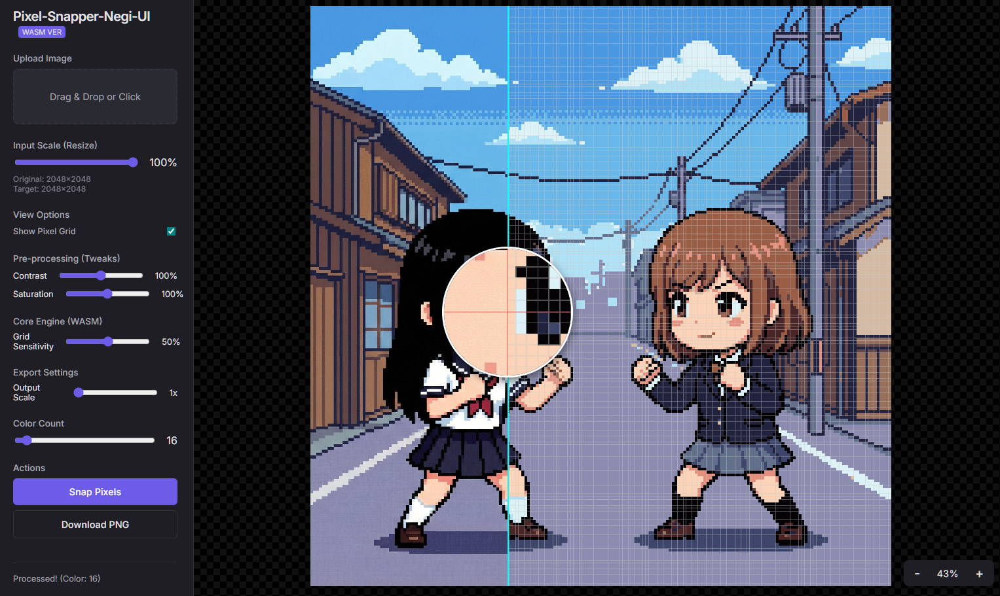

# Pixel-Snapper-Negi-UI (WASM Ver)




**Pixel-Snapper-Negi-UI** は、AIで作成したドット画像を美しいピクセルアート風に変換するための[spritefusion-pixel-snapper](https://github.com/Hugo-Dz/spritefusion-pixel-snapper)用のWeb UIツールです。


## ⚠️ 重要: 動作環境について

本ツールは **Rust (プログラミング言語)** のインストールは**不要**です。ただし、ブラウザのセキュリティ制約（CORS）のため、ダウンロードして直接 `index.html` を開くだけでは動作しません。
以下の手順で簡易的なWebサーバーを立ち上げてご利用ください。

## 🔰 使い方 (Pythonを使用する場合)

Windowsをお使いの場合、Pythonがインストールされていれば以下の手順で簡単に起動できます。

1.  **コマンドプロンプト（またはPowerShell）を開く**
    *   このフォルダ（`Pixel-Snapper-Negi-UI`）の中で、何もないところを `Ctrl` + `右クリック` し、「ターミナルで開く」を選択すると便利です。

2.  **サーバーを起動する**
    以下のコマンドを入力して Enter キーを押してください。
    ```bash
    python -m http.server 8000
    ```

3.  **ブラウザでアクセスする**
    Chrome や Edge などのブラウザを開き、以下のアドレスにアクセスしてください。
    [http://localhost:8000/](http://localhost:8000/)

これでツールが使用可能になります！

---

## 🔧 開発者向け情報

自分で機能を改造したい方向けの情報です。**通常利用では気にしなくて大丈夫です。**

### 構成
*   `src/`: 画面の動きを作るJavaScriptファイル
*   `pkg/`: 高速計算を行うエンジン（WASM）※ビルド済み

### Rustについて
ユーザーとして利用するだけであれば、**Rustのインストールは不要です**（`pkg/` フォルダにコンパイル済みのファイルが含まれているため）。
エンジンの内部ロジック（Rustコード）を書き換えて再ビルドしたい場合のみ、Rust環境と `wasm-pack` が必要になります。

### ビルド方法 (Rust)
```bash
cd SpriteFusion-Pixel-Snapper
wasm-pack build --target web --out-dir ../pkg
```

## ライセンス
MIT License
